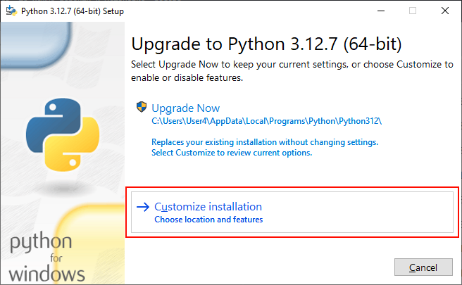

# Практика развертывания web-приложения с помощью Docker

## 1. Подготовка к созданию приложения и установка компонент

Наше приложение будет состоять из 2 частей **frontend** и **backend**, которые будут обмениваться между собой с помощью http-запросов.
Мы будем создавать приложения с использование js-фреймворка `vuejs` 3 версии и с использование фреймворка `Django`. Для создания веб приложения с использованием этих технологий нам необходимы следующие инструменты, перед непосредственной разработкой установим их.

### 1.1 Установка `python`

На `python` в нашем приложении будет реализован бэкенд.

Сначала проверим установлен ли `python` или нет. Для этого в командной строке введем следующую команду

```bash
python -V
```

Если команда успешно отработала, то можно перейти к установке `nodejs`.

Если `python` не установлен, то идем на сайт и качаем python, либо сразу по [ссылке](https://www.python.org/downloads/release/python-3127/) внизу выбираем нужную версию ос и скачиваем.

После скачивания открываем установщик и выбираем кстомную установку



Затем оставляем все по умолчанию


Идем дальше и устанавливаем


После чего, проверяем в командной строке что все успешно установилось
```bash
python -V
```

Вывелась версия, значит все ок и идем дальше!

### 1.2 Установка `Node JS`

Реализовывать фронтенд часть нашего приложения мы будем с помощью фреймворка `VueJS` для него необходимо посавить "ноду" (она же `nodejs`). В кратче это платформа, с помощью которой можно запустить приложение написанное на javascript.

> Javascript - это тоже язык программирования. Отличный материал по введению что это можно открыть [здесь](https://learn.javascript.ru/intro).


Проверим, установлена ли "нода" выполним команду

```bash
npm -v
```

Данной командой мы проверяем установлен ли пакетный менеджер `nodejs`

Если выводится версия, то все хорошо, скачивать и устанавливать его не нужно. Если нет то идем ставить.

На официальном [сайте](https://nodejs.org/en) выбираем скачать, скорее всего версия 22.11. После чего запускаем установщик, все оставляем по умолчанию.

После установки проверяем что все установилось также командой

```bash
npm -v
```

Установим пакет для создания `vuejs` приложений следующей командой

```bash
npm install -g @vue/cli
```

## 2. Создание фронтенд части приложения

