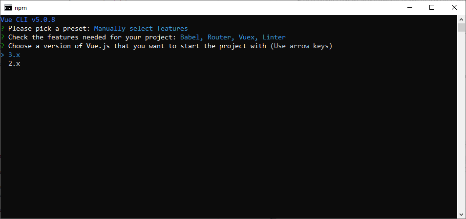

# Практика развертывания web-приложения с помощью Docker

## 1. Подготовка к созданию приложения и установка компонент

Наше приложение будет состоять из 2 частей **frontend** и **backend**, которые будут обмениваться между собой с помощью http-запросов.
Мы будем создавать приложения с использование js-фреймворка `vuejs` 3 версии и с использование фреймворка `Django`. Для создания веб приложения с использованием этих технологий нам необходимы следующие инструменты, перед непосредственной разработкой установим их.

### 1.1 Установка `python`

На `python` в нашем приложении будет реализован бэкенд.

Сначала проверим установлен ли `python` или нет. Для этого в командной строке введем следующую команду

```bash
python -V
```

Если команда успешно отработала, то можно перейти к установке `nodejs`.

Если `python` не установлен, то идем на сайт и качаем python, либо сразу по [ссылке](https://www.python.org/downloads/release/python-3127/) внизу выбираем нужную версию ос и скачиваем.

После скачивания открываем установщик и выбираем кстомную установку


Затем оставляем все по умолчанию


Идем дальше и устанавливаем


После чего, проверяем в командной строке что все успешно установилось
```bash
python -V
```

Вывелась версия, значит все ок и идем дальше!

### 1.2 Установка `Node JS`

Реализовывать фронтенд часть нашего приложения мы будем с помощью фреймворка `VueJS` для него необходимо посавить "ноду" (она же `nodejs`). В кратче это платформа, с помощью которой можно запустить приложение написанное на javascript.

> Javascript - это тоже язык программирования. Отличный материал по введению что это можно открыть [здесь](https://learn.javascript.ru/intro).


Проверим, установлена ли "нода" выполним команду

```bash
npm -v
```

Данной командой мы проверяем установлен ли пакетный менеджер `nodejs`

Если выводится версия, то все хорошо, скачивать и устанавливать его не нужно. Если нет то идем ставить.

На официальном [сайте](https://nodejs.org/en) выбираем скачать, скорее всего версия 22.11. После чего запускаем установщик, все оставляем по умолчанию.

После установки проверяем что все установилось также командой

```bash
npm -v
```

Установим пакет для создания `vuejs` приложений следующей командой

```bash
npm install -g @vue/cli
```

## 2.  Организация приложения

Для структуризации будет создавать приложение в папке `todo-app`

> Важно! Необходимо чтобы полный путь до директории `todo-app` не содержал в себе символов кирилицы (т.е. например "C:\work\todo-app" - ОК, а "С:\пользователь232\todo-app" нет) 

## 3. Создание фронтенд части приложения

### 3.1 Создание vue проекта

Для создания `vue` приложения **перейдем в папку todo-app** и откроем командную строку ней.

В командной строке создаем vue приложение командой

```bash
vue create frontend
```

В консоли откроется менеджер создания приложения выберем ручную установку (3 пункт выбираем и жмем `Enter`)


На следующей шаге выберем настройки нашего проекта нажимая "ПРОБЕЛ"


После выбора, нажимаем `Enter` - переходим к следующему шагу с выбром версии и выбираем 3 версию



На следующем шаге выбираем **n**


Дальше по умолчанию


Снова по умолчанию


На последнем шаге выбираем **n** - не сохраняем пресет создания проекта


Нажимаем `Enter` и ждем пока создается проект


Когда создание завершится - в папке `todo-app` создаться каталог `frontend` с нашим фронтенж приложением, мы можем его запустить выполнив следующие команды:

```bash
cd frontend
npm run serve
```

Последней командой мы как раз запускаем наше приложение, которое можно посмотреть перейдя по адресу [http://localhost:8080/](http://localhost:8080/). Должно получится следующее


Если все ок, то можно вернутся в терминал и остановить сервер командой `Ctrl+C`

### 3.2 Добавление библиотек и фреймворков (tailwindcss, axios)


### 3.3 Добавление шаблонов для страниц


## 4. Создание бэкенда

Для бэкенда мы будем использовать `Django` фреймворк. Но сперва создадим в директории `todo-app` каталог `backend`, перейдем в него и откроем из этой папки командную строку. 

### 4.1 Создание виртуального окружения

Виртуальное окружение нужно для того, чтобы библиотеки, используемые в нашем текущем проекте не конфликтовали с другими будущими проектами. Некоторые версии библиотек python не дружат с другими версиями, создание виртуального окружения под свойпроект является хорошей практикой.

Существует несколько способов создания виртуального окружения. Самый простой с помощью библиотеки `python`.

Установим библиотеку для создания виртуальных окружений с помощью пакетного менеджера `pip`.

```bash
pip install virtualenv
```

С помощью это команды мы устанавливаем библиотеку в глобальное хранилище библиотек `python`.

Затем в директории `backend` нашего приложения `todo-app` создаем виртуальное окружение командой.

```bash
python -m virtualenv .venv
```

После чего в каталоге `backend` должна появиться папка `.venv` в которой будет содержаться интерпретатор и набор библиотек (модулей).

### 4.2 Создание проекта Django

Создадим наше приложение `Django`. Для это сперва **активируем наше виртуальное окружение** которое мы создали под наш проект.

Выполним следующую команду (Для не Windows команды может отличаться см. активировать venv + ВАША_ОС)

```bash
.venv\Scripts\activate
```

Слева в терминале должно появиться `(.venv)` - что говорит о том, что мы успешно активировали виртуальное окружение.
Теперь мы можем устанавливать различные библиотеки в него, которые не будут мешать и конфликтовать с модулями из глобального хранилища библиотек.

Установим `Django` фреймворк в наше виртуальное окружение, воспользуемся все тем же пакетным менеджером `pip`, только теперь модули будут ставится не глобально а наше окружение `.venv`, т.к. оно активировано у нас сейчас.

```bash
pip install django 
```

Теперь мы можем создать django приложение, для этого выполним следующую команду (находясь в папке `backend`)

```bash
django-admin startproject backend .
```

После чего должны появиться каталог `backend` (его называют пакет конфигурации) и файл `manage.py` (это модуль - обертка над командами джанго)

Мы создали стартовое приложение `django`, можем попробовать его запустить, для это как раз вызовем модуль `manage.py` и передадим ему параметр `runserver`

```bash
manage.py runserver
```

Теперь перейдем по адресу [http://127.0.0.1:8000/](http://127.0.0.1:8000/), где будет запущена дефолтная страница фреймворка django 


Если все ок, то можем вернутся в консоль и остановить сервер командой `Ctrl+C`

### 4.3 Добавление логики приложения


## 5 Фронтенд + бэкенд + postgres


## 6 Создание Docker-образов

### 6.1 Docker образ для фронтенда


### 6.2 Docker образ для бэкенда


## 7 Оркестрация контейнеров с использованием docker compose
