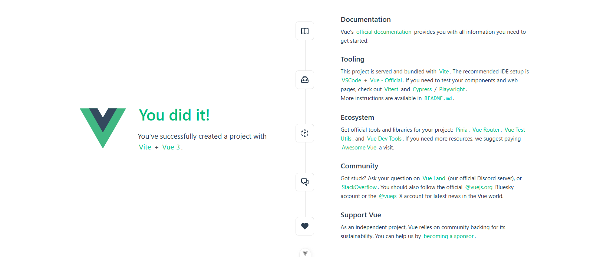

# Практика развертывания web-приложения с помощью Docker

## 1. Подготовка к созданию приложения и установка компонент

Наше приложение будет состоять из 2 частей **frontend** и **backend**, которые будут обмениваться между собой с помощью http-запросов.
Мы будем создавать приложения с использование js-фреймворка `vuejs` 3 версии и с использование фреймворка `Django`. Для создания веб приложения с использованием этих технологий нам необходимы следующие инструменты, перед непосредственной разработкой установим их.

Исходный код проекта доступен на [github](https://github.com/innominity/todo-app).

### 1.1 Установка `python`

На `python` в нашем приложении будет реализован бэкенд.

Сначала проверим установлен ли `python` или нет. Для этого в командной строке введем следующую команду

```bash
python -V
```

Если команда успешно отработала, то можно перейти к установке `nodejs`.

Если `python` не установлен, то идем на сайт и качаем python, либо сразу по [ссылке](https://www.python.org/downloads/release/python-3127/) внизу выбираем нужную версию ос и скачиваем.

После скачивания открываем установщик и выбираем кстомную установку


Затем оставляем все по умолчанию


Идем дальше и устанавливаем


После чего, проверяем в командной строке что все успешно установилось
```bash
python -V
```

Вывелась версия, значит все ок и идем дальше!

### 1.2 Установка `Node JS`

Реализовывать фронтенд часть нашего приложения мы будем с помощью фреймворка `VueJS` для него необходимо посавить "ноду" (она же `nodejs`). В кратче это платформа, с помощью которой можно запустить приложение написанное на javascript.

> Javascript - это тоже язык программирования. Отличный материал по введению что это можно открыть [здесь](https://learn.javascript.ru/intro).


Проверим, установлена ли "нода" выполним команду

```bash
npm -v
```

Данной командой мы проверяем установлен ли пакетный менеджер `nodejs`

Если выводится версия, то все хорошо, скачивать и устанавливать его не нужно. Если нет то идем ставить.

На официальном [сайте](https://nodejs.org/en) выбираем скачать, скорее всего версия 22.11. После чего запускаем установщик, все оставляем по умолчанию.

После установки проверяем что все установилось также командой

```bash
npm -v
```

Установим пакет для создания `vuejs` приложений следующей командой

```bash
npm install -g @vue/cli
```

## 2.  Организация приложения

Для структуризации будет создавать приложение в папке `todo-app`

> Важно! Необходимо чтобы полный путь до директории `todo-app` не содержал в себе символов кирилицы (т.е. например "C:\work\todo-app" - ОК, а "С:\пользователь232\todo-app" нет) 

## 3. Создание фронтенд части приложения

### 3.1 Создание vue проекта

Для создания `vue` приложения **перейдем в папку todo-app** и откроем командную строку ней.

В командной строке создаем vue приложение командой

```bash
vue create vue@latest
```

В консоли откроется менеджер создания приложения (иногда требует установки `create-vue`) последней версии, для этого нужно подтвердить введя `y` и нажав `Enter`

Выбираем project name (target directory) `frontend`

Из всех опций выбираем `Prettier (code formatting)`, далее оставляем все по умолчанию

```bash
◇  Project name (target directory):
│  frontend
│
◇  Select features to include in your project: (↑/↓ to navigate, space to select, a to toggle all, enter to confirm)
│  Prettier (code formatting)
│
◇  Select experimental features to include in your project: (↑/↓ to navigate, space to select, a to toggle all, enter to confirm)
│  none
│
◇  Skip all example code and start with a blank Vue project?
│  No

Scaffolding project in D:\Work\Tests\todo-app\frontend...
│
└  Done. Now run:

   cd frontend   
   npm install   
   npm run format
   npm run dev   

| Optional: Initialize Git in your project directory with:

   git init && git add -A && git commit -m "initial commit"
```

Проект создался, теперь предлагают перейти в папку `frontend` и выполнить установку библиотек

Выполняем
```bash
cd frontend
npm install
```

Нажимаем `Enter` и ждем пока идет установка


После установки зависимостей в наже приложение `frontend` мы можем его запустить командой

> Важно находится в папке проекта `frontend`

```bash
npm run dev
```

Последней командой мы как раз запускаем наше приложение, которое можно посмотреть перейдя по адресу [http://localhost:5173//](http://localhost:5173/). Должно получится следующее



Если все ок, то можно вернутся в терминал и остановить сервер командой `Ctrl+C`

### 3.2 Добавление библиотек и фреймворков (tailwindcss, axios)

Установим пару модулей для упрощения создания приложения

**Axios** - библиотека содержит упрощеннный функционал для отправки запросов

Установим `axios`, для этого откроем терминал в каталоге `frontend` и выполним следующую команду:

```bash
npm install axios
```

**Tailwind CSS** - фреймворк с готовыми стилями, установим его выполнив следующие команды

Для установки его проследуем следующим инструкциям со страницы [https://tailwindcss.com/docs/installation/using-vite](https://tailwindcss.com/docs/installation/using-vite)

Находясь в каталоге `frontend` в консоли запускаем команду:

```bash
npm install tailwindcss @tailwindcss/vite
```

Находим файл `vite.config.js` и меняем его содержимое

```js
import { fileURLToPath, URL } from 'node:url'

import { defineConfig } from 'vite'
import vue from '@vitejs/plugin-vue'
import vueDevTools from 'vite-plugin-vue-devtools'
// добавили
import tailwindcss from '@tailwindcss/vite'

// https://vite.dev/config/
export default defineConfig({
  plugins: [
    vue(),
    vueDevTools(),
    // добавили
    tailwindcss()
  ],
  resolve: {
    alias: {
      '@': fileURLToPath(new URL('./src', import.meta.url))
    },
  },
})

```

После чего добавляем стили `tailwindcss`

Файл `/src/assets/main.css` - если файла нет - то создаем
```css
@import "tailwindcss";
```


### 3.3 Добавление шаблонов для страниц

Добавим шаблон нашей страницы, для этого возьмем исходники из репозитория [github](https://github.com/innominity/todo-app). В репозитории перейдем в каталог `frontend`, оттуда скопируем директорию `src` в каталог нашего приложения `frontend`.

## 4. Создание бэкенда

Для бэкенда мы будем использовать `Django` фреймворк. Но сперва создадим в директории `todo-app` каталог `backend`, перейдем в него и откроем из этой папки командную строку. 

### 4.1 Создание виртуального окружения

Виртуальное окружение нужно для того, чтобы библиотеки, используемые в нашем текущем проекте не конфликтовали с другими будущими проектами. Некоторые версии библиотек python не дружат с другими версиями, создание виртуального окружения под свойпроект является хорошей практикой.

Существует несколько способов создания виртуального окружения. Самый простой с помощью библиотеки `python`.

Установим библиотеку для создания виртуальных окружений с помощью пакетного менеджера `pip`.

```bash
pip install virtualenv
```

С помощью это команды мы устанавливаем библиотеку в глобальное хранилище библиотек `python`.

Затем в директории `backend` нашего приложения `todo-app` создаем виртуальное окружение командой.

```bash
python -m virtualenv .venv
```

После чего в каталоге `backend` должна появиться папка `.venv` в которой будет содержаться интерпретатор и набор библиотек (модулей).

### 4.2 Создание проекта Django

Создадим наше приложение `Django`. Для это сперва **активируем наше виртуальное окружение** которое мы создали под наш проект.

Выполним следующую команду (Для не Windows команды может отличаться см. активировать venv + ВАША_ОС)

```bash
.venv\Scripts\activate
```

Слева в терминале должно появиться `(.venv)` - что говорит о том, что мы успешно активировали виртуальное окружение.
Теперь мы можем устанавливать различные библиотеки в него, которые не будут мешать и конфликтовать с модулями из глобального хранилища библиотек.

Установим `Django` фреймворк в наше виртуальное окружение, воспользуемся все тем же пакетным менеджером `pip`, только теперь модули будут ставится не глобально а наше окружение `.venv`, т.к. оно активировано у нас сейчас.

```bash
pip install django 
```

Установим также еще пару библиотек, они понадобятся для упрощения создания приложения

```bash
pip install djangorestframework django-cors-headers
```

Теперь мы можем создать django приложение, для этого выполним следующую команду (находясь в папке `backend`)

```bash
django-admin startproject backend .
```

После чего должны появиться каталог `backend` (его называют пакет конфигурации) и файл `manage.py` (это модуль - обертка над командами джанго)

Мы создали стартовое приложение `django`, можем попробовать его запустить, для это как раз вызовем модуль `manage.py` и передадим ему параметр `runserver`

```bash
manage.py runserver
```

Теперь перейдем по адресу [http://127.0.0.1:8000/](http://127.0.0.1:8000/), где будет запущена дефолтная страница фреймворка django 


Если все ок, то можем вернутся в консоль и остановить сервер командой `Ctrl+C`

### 4.3 Добавление логики приложения

Добавим код бэкенда, для этого возьмем исходники из репозитория [github](https://github.com/innominity/todo-app). В репозитории перейдем в каталог `backend`, оттуда скопируем все файлы и директории в каталог нашего приложения `backend`.

Выполним миграции.

> Что такое миграции [сюда](https://timeweb.cloud/blog/migraciya-bazy-dannyh-kak-sdelat)

В директории `todo/backend` с активированным окружением запускаем команду

```bash
manage.py migrate
```

После чего начнется процес миграции, результатом которого станет созданная база данных `db.sqlite3`, которая для django используется по умолчанию (она появится в каталоге).
В базе данных будут созданы необходимые таблички для приложения, в том числе таблица, где будут хранится наши задания `todo_todotask`.

## 5 Фронтенд + бэкенд - Все, вместе и сразу

## 6 Создание Docker-образов

### 6.1 Docker образ для фронтенда

В каталоге `todo-app/frontend` создаем файл `Dockerfile` со следующим содержимым

```
# Указать базовый образ
FROM node:20

WORKDIR /app

# Подтянуть зависимости нашего приложения
COPY ./package.json ./package.json
COPY ./package-lock.json ./package-lock.json

# Установить библиотеки
RUN npm install

# Скопировать исходники
COPY . .

EXPOSE 8080

# Запустить наше приложение
CMD [ "npm", "run", "serve" ]
```

### 6.2 Docker образ для бэкенда

В каталоге `todo-app/backend` создаем файл `Dockerfile` со следующим содержимым

```
FROM python:3.10.15

ENV PYTHONUNBUFFERED 1
ENV PYTHONDONTWRITEBYTECODE 1

WORKDIR /home/app

# Копируем файл с зависимостями приложения
COPY requirements.txt requirements.txt
# Устанавливаем зависимости
RUN pip install -r requirements.txt

# Копируем исходники
COPY . .

EXPOSE 8000

# Запускаем приложение
CMD ["python", "-m", "manage", "runserver", "0.0.0.0:8000" ]
```

## 7 Оркестрация контейнеров с использованием docker compose

Для того чтобы не запускать контейнеры по однму их можно объединить в 1 файл docker-compose.

Создадим в директории `todo-app` файл `docker-compose.dev.yml` со следующим содержимым

```
services:
  web:
    build: backend
    env_file:
      - .dev.env
    ports:
      - "8000:8000"

  frontend:
    build: frontend
    ports:
      - "8080:8080"
    depends_on:
      - web
```

Данный файл будт конфигурацией docker для локальной разработки разработки, в который нужно передать файл окружения `.dev.env`. 

Создадим файл с переменными окружения `.dev.env` и заполним следующими значениями

```
SECRET_KEY=12321321312
```

Теперь мы можем запустить сразу 2 контейнера 1 командой (но сначала нужно их сбилдить)

```bash
docker compose -f docker-compose.dev.yml build
```

Флагом `-f` мы указываем путь до файла docker-compose

После чего можем запустить

```bash
docker compose -f docker-compose.dev.yml up
```

И проверить результат работы перейдя на [http://localhost:8080](http://localhost:8080)

------------